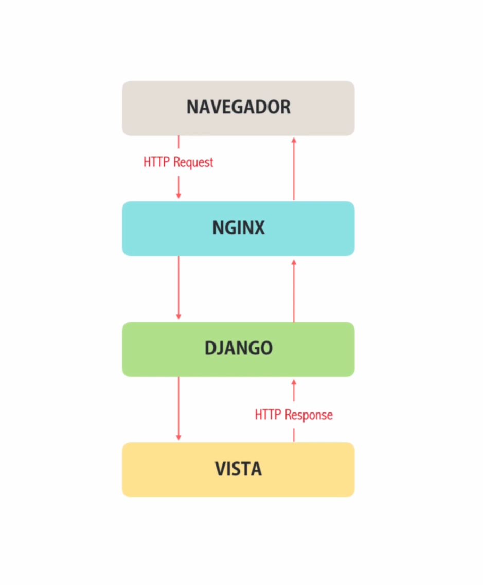
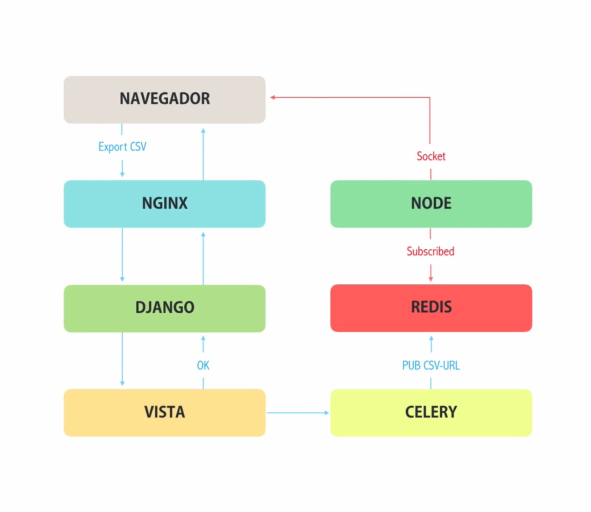

# Django -> Nginx -> Celery -> Redis -> Node Stack

## _Based on [this](https://youtu.be/cr0cbJ2PkJY) youtube video_





**How to run the code**

* First run the redis server as

    ```sh
    redis-server
    ```

* Go to ```django/``` folder and run the server:

    ```sh
    python manage.py runserver
    ```

* Run celery (also inside ```django/``` folder):

    ```sh
    celery worker -A celery_realtime -l info -P gevent
    ```

* Run node server inside ```node/``` folder:

    ```sh
    npm start
    ```
